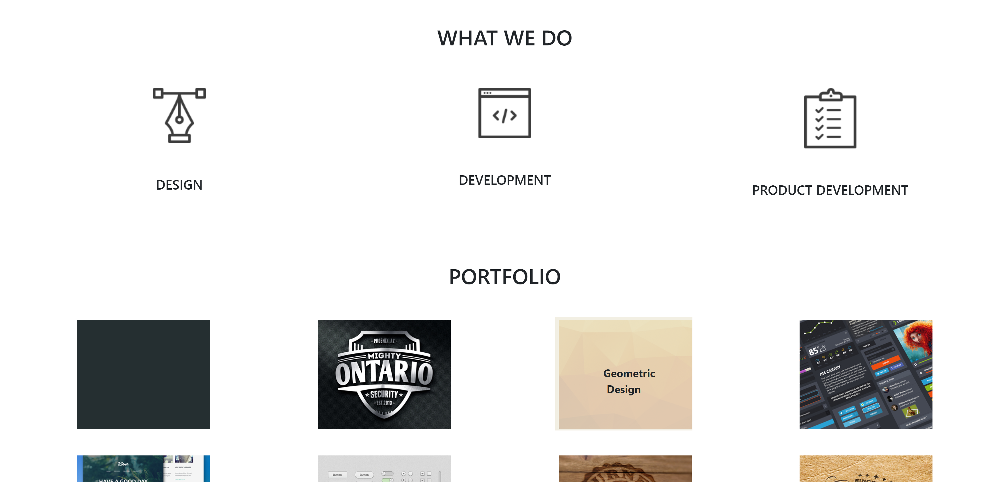

### DELANI STUDIO
This is a website for a company that deals with dsign, product management and developmet. It has a section describing the company and a section that showcases its previous work. At the end of the page, it has a simple form that allows the user to enter their details and sends a message to the company,

## AUTHOR
Nicollette Ochola

## TECHNOLOGIES USED
- HTML
- CSS (Bootstrap)
- JAVASCRIPT (jQuery 3.4.1)

## Set up instructions
- Have a good internet connection
- Copy the code onto JS fiddle or the JS console

## BEHAVIOUR DRIVEN DEVELOPMENT
- Diaplays an overview of the company from what they do and the work the have done.
- Has form at the end of the web page with three inputs. Name, Email and a section to type a message to the company.

## KNOWN BUGS 
The lower part of the webpage from contact us below is not responsive in all media. 

If you find any other bugs while navigating this webpage feel free to raise an issue specifying what went wrong.

## LINK TO LIVE SITE 
https://nicolletteochola.github.io/DelaniStudio/

## CONTACT DETAILS
- email: nicoleochola@gmail.com
- Number: 0726868063
## LICENCE
MIT Licence Copyright (c) (Nicollette Ochola)
 

